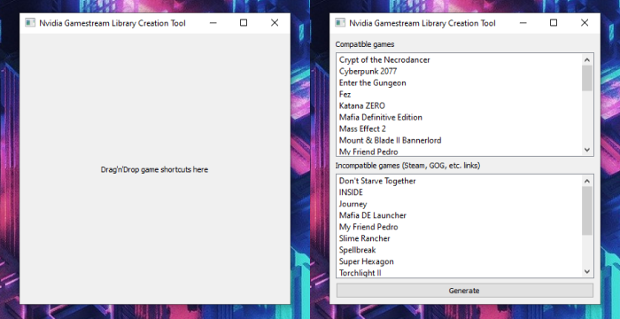
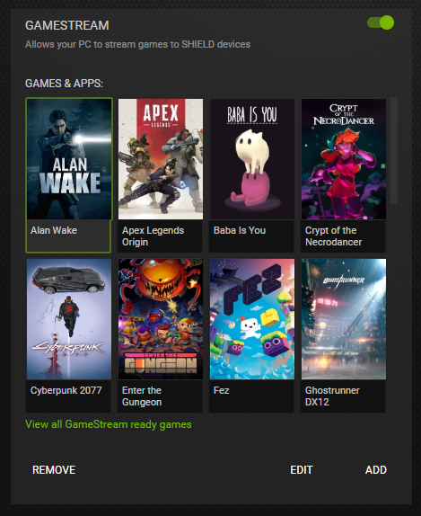

## Nvidia Gamestream Library Creation Tool

This application populates a Nvidia Gamestream Shield library with games that did not add automatically to the list.

## Instructions
1. Drag'n'drop game shortcuts to window.
2. Press `Generate`.
3. If `Success` is shown, then it is done :)

Result:

## References:
1. https://docs.microsoft.com/en-us/windows/deployment/usmt/usmt-recognized-environment-variables
2. https://www.learnpyqt.com/tutorials/basic-widgets/
1. https://www.riverbankcomputing.com/static/Docs/PyQt5/index.html
2. https://github.com/pyqt/examples
3. https://www.geeksforgeeks.org/pyqt5-qlistwidget-python/
4. https://stackoverflow.com/questions/34143233/pyqt-mainwindow-not-showing-widgets
5. https://stackoverflow.com/questions/49494759/qmainwindow-vs-qwidget
6. http://zetcode.com/gui/pyqt5/dragdrop/
7. http://zetcode.com/pyqt/qpushbutton/
8. https://stackoverflow.com/questions/45308101/how-pyqt5-keypressevent-works
9. https://stackoverflow.com/questions/12429088/retrieve-jpg-pictures-from-url-python